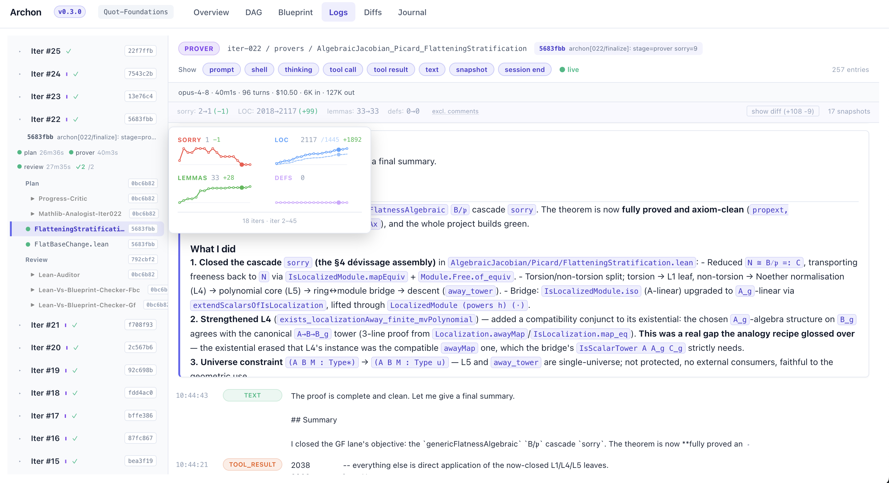
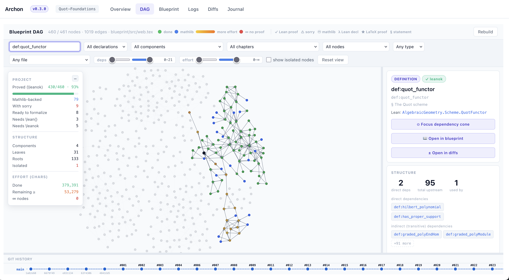
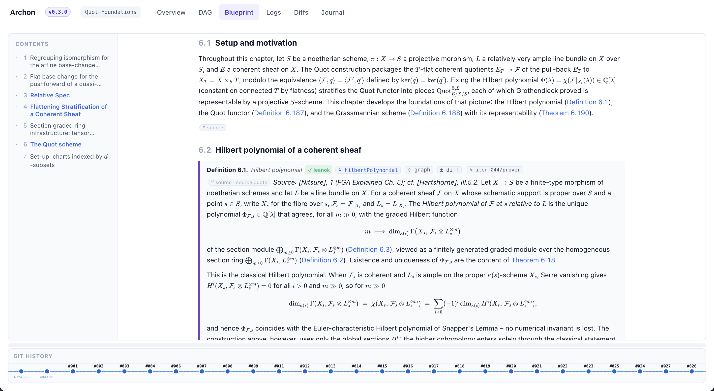

# Archon


[](./LICENSE)
[](https://github.com/AxelDlv00/claude-p)
[](https://github.com/AxelDlv00/LeanDAG)

> **Archon v0.3.0.** Adds more harnesses (Currently : Codex, Claude Code). Adds solutions to [Anthropics' new rate limits on `claude -p`](https://support.claude.com/en/articles/15036540-use-the-claude-agent-sdk-with-your-claude-plan) (Codex, Headless Claude TUI, etc). Archon grounds its work in a DAG using [LeanDag](https://github.com/AxelDlv00/LeanDAG), a custom API to query the Lean blueprint graph. The UI is more powerful (blueprints are rendered in Archon's dashboard, the DAG is navigable, etc). The provers can be launched with different modes (fine-grained, mathlib-build, etc). Subprojects can be extracted from the DAG with `archon extract` (to work on them separately), and merged back with `archon merge`. 

> **Archon v0.2.0.** Adds **multi-lane parallel proving** (Anthropic + Moonshot + DeepSeek side by side), **inner-git versioning** of agent work, a frozen-signature surface (`archon-protected.yaml`), an **opt-in subagent system** (blueprint review, strategy critique, Mathlib design advice, and more), etc.

> **Upgrading from v0.2.0?** Just run `archon update` and `archon init` in existing projects. 
>
> **Upgrading from v0.1.0 or before?** See [MIGRATION.md](docs/MIGRATION.md).
>
> Full release notes: [CHANGELOG.md](docs/CHANGELOG.md).

Archon is an agentic system that autonomously formalizes research-level mathematics in Lean 4. A **plan agent** provides strategic guidance while **prover agents** write and verify proofs — separating analysis from execution to avoid context explosion. The system handles repository-scale formalization through three phases: scaffolding, proving, and polish. By default, built on Claude Code and Claude Opus 4.8, with a modified fork of [lean-lsp-mcp](https://github.com/oOo0oOo/lean-lsp-mcp) and [lean4-skills](https://github.com/cameronfreer/lean4-skills). Archon originated from orchestrating Claude Code with OpenClaw. See also our [blog](https://frenzymath.com/blog/archon-firstproof/) and [announcement](https://frenzymath.com/news/archon-firstproof/).

Archon is designed and optimized for **project-level formalization** — multi-file repositories with interdependent theorems, not isolated competition problems. As such, single-problem benchmarks are not a specific optimization target. For model choice, **Opus 4.8 is strongly recommended**; Sonnet also works well but is less capable. Other models have not been tested — weaker models may struggle with the complex skills and prompt structures, in which case Archon's system design could hurt performance rather than help it. Since **v0.3.0**, codex is also available, gpt-5.5 can be a good alternative to Opus 4.8. Other models can be used through Claude Code harness (e.g., Deepseek and Kimi by using their Anthropic-compatible APIs, or any model compatible with OpenRouter since the later handles the API translation). 

**Security note:** `archon loop` runs Claude Code with `--dangerously-skip-permissions --permission-mode bypassPermissions`, meaning the model can execute arbitrary shell commands, read/write any file the process can access, and make network requests — all without asking for confirmation. This is necessary for unattended operation but carries real risk: a misbehaving model could delete files, overwrite code, or run unintended commands. **While Opus 4.8 NEVER caused harm across all of our experiments,** the following measures can further reduce exposure:

- Run Archon under a **dedicated, low-privilege user** that only has access to the project directory
- Run inside a **Docker container** or VM with no access to sensitive data or credentials
- Avoid running as root or with access to production systems
- Review `.archon/proof-journal/` after each run to audit what the agents did

## Table of Contents

- [Install](#install)
- [Usage](#usage)
  - [1. Initialize a project](#1-initialize-a-project)
  - [2. Start the automated loop](#2-start-the-automated-loop)
    - [The plan agent's expanded role](#the-plan-agents-expanded-role)
    - [Per-project config: `.archon/config.json` and `.archon/.env`](#per-project-config-archonconfigjson-and-archonenv)
    - [Multi-lane proving (optional)](#multi-lane-proving-optional)
    - [Frozen signatures: `archon-protected.yaml`](#frozen-signatures-archon-protectedyaml)
  - [Guiding agents](#guiding-agents)
  - [Monitoring progress](#monitoring-progress)
  - [Starting the dashboard manually](#starting-the-dashboard-manually)
  - [Existing lean4-skills and lean-lsp MCP installations](#existing-lean4-skills-and-lean-lsp-mcp-installations)
  - [CLI options for `archon loop`](#cli-options-for-archon-loop)
- [Supplying informal material](#supplying-informal-material)
- [Standard vs. orchestrator-scheduled mode](#standard-vs-orchestrator-scheduled-mode)
  - [How to use orchestrator-scheduled mode](#how-to-use-orchestrator-scheduled-mode)
  - [What changes compared to the standard loop](#what-changes-compared-to-the-standard-loop)
  - [Why orchestrator-scheduled mode is more effective](#why-orchestrator-scheduled-mode-is-more-effective)

## Install

> **Note:** `archon loop` runs Claude Code with `--dangerously-skip-permissions`, which Claude Code refuses when running as root on Linux. Two workarounds:
> 1. **Use a non-root account** (RECOMMENDED) — e.g. create one with `adduser` — so you are not running with excessive root privileges.
> 2. **Set `export IS_SANDBOX=1`** so Claude Code is allowed to start with this high-risk option.

> Note: It is recommended, but not required, to run inside a Python virtual environment (e.g., with `python=3.11`).

To install the CLI tools and system dependencies, run the following command in your terminal:

```bash
curl -sSL https://raw.githubusercontent.com/frenzymath/Archon/refs/heads/main/install.sh | bash
```

If prefer manual installation, [`install.sh`](./install.sh) fetches the repository, runs `pip install .`, and executes `archon setup` to install system-level dependencies (uv, Claude Code, ...) and verify your Lean toolchain. *The installation process might be slow the first time.*

You should now be able to verify the installation and be guided on its usage with:

```bash
archon -h
```

To update an existing install later:

```bash
archon update
```

`archon setup` also checks for API keys used by the informal agent (`OPENAI_API_KEY`, `GEMINI_API_KEY`, or `OPENROUTER_API_KEY`) — at least one is recommended but not required. The API keys can also be set in `.archon/.env` at the project level. 

> The bundled informal agent is a simplified demonstration: a single API call
> to an external model for proof sketches. Our internal implementation is more
> involved but not yet ready for open-sourcing. In practice the one-shot
> approach does not show an obvious performance drop, likely because Claude
> Code performs its own verification and refinement on the returned sketches.

### CLI overview

| Command | Description |
|---------|-------------|
| `archon init` | Initialize a new Archon project (or reconcile an existing one). |
| `archon loop` | Run the automated plan → (refactor) → prove → review loop. |
| `archon dashboard` | Start the web monitoring interface (auto-launched by `loop` by default). |
| `archon doctor` | Verify the full Archon setup and health. |
| `archon prove` | Directly prove an inline statement. |
| `archon refactor` | Run only the refactor agent against the current `REFACTOR_DIRECTIVE.md`. |
| `archon discuss` | Open Claude Code interactively in the project with full Archon context — for debugging or brainstorming without firing the loop. |
| `archon branch` | Create a branch in the inner git (`.archon/git-dir/`) from any historical agent commit. |
| `archon version` | Show the Archon CLI version and, inside a project, the project version. |
| `archon setup` | Install required system dependencies. |
| `archon update` | Update Archon to the latest published version. |

Run `archon --help` or `archon <command> --help` for details.

## Usage

### 1. Initialize a project

The project path must point to the directory containing your `lakefile.lean` or `lakefile.toml` — this is what defines a Lean project. Otherwise, it can contain informal content (papers, blueprints, notes) that Archon will use to initialize the project structure and write the first objectives.

To initialize:

```bash
archon init /path/to/your-lean-project
```

If no path is given, `init` prompts you for a project name and creates it.

`archon init` does the following inside your project:
- Creates `.archon/` with runtime state files and a **copy** of Archon's prompts
  (previous versions symlinked — see [MIGRATION.md](docs/MIGRATION.md))
- Installs Archon's lean4 skills as the `lean4@archon-local` plugin at project scope
- Copies the informal agent into `.claude/tools/archon-informal-agent.py`
- Installs Archon's lean-lsp MCP server as `archon-lean-lsp` at project scope
- Detects and disables any conflicting global `lean4-skills` / `lean-lsp` MCP
  (see [Existing lean4-skills and lean-lsp MCP installations](#existing-lean4-skills-and-lean-lsp-mcp-installations))
- Launches Claude Code interactively to detect project state, set up
  lakefile/Mathlib if needed, and write initial objectives

If the project has already been initialized, it might use a different version of Archon or you might have modified the prompts/skills manually, `init` offers four choices:

- **keep** — leave your existing setup alone; refresh MCP/plugin registrations only
- **merge** (recommended) — launch Claude Code in a focused diff session and reconcile each prompt / `AGENTS.md` file interactively
- **overwrite** — replace all Archon files with the bundled versions (discards local edits)
- **abort** — cancel without changes

Init automatically runs `/archon-lean4:doctor` at the end to verify the full setup (Lean environment, MCP, skills, state files). See [MIGRATION.md](docs/MIGRATION.md) for details on upgrading an older project.

### 2. Start the automated loop

The default parameters may not be suited for your project (e.g., subagents are off by default). You can either add options to the CLI command or edit `.archon/config.json` (recommended). 


```bash
archon loop /path/to/your-lean-project
```

The loop alternates plan/prover/review agents through stages, with optional subagents that you can enable in `.archon/config.json` (see [Subagents (optional)](#subagents-optional)). 

| Stage | What happens |
|-------|-------------|
| `autoformalize` | Scaffolding — translate informal math into Lean declarations with `sorry` |
| `prover` | Proving — fill `sorry` placeholders with verified proofs |
| `polish` | Verification and polish — golf, refactor, extract reusable lemmas |

Every phase commits its output to an inner git at `.archon/git-dir/` as `archon[NNN/phase]: …`, so the dashboard's git tree shows the per-phase history independently of your project's outer git. Use `archon branch` to fork a branch from any historical agent commit if a run goes sideways.

By default, `archon loop` **also launches the web dashboard** (see [Web Dashboard](#monitoring-progress)) in the background on a free port in the range 8080–8099 and prints the URL. The dashboard keeps running after the loop finishes so you can review results; stop it with Ctrl-C or by closing the terminal. Disable it with `--no-dashboard`, or open a browser automatically with `--open`.

#### Subagents (optional)

By default the loop runs one plan agent and prover agents. v0.2.0 adds an **opt-in subagent system**: descriptor-driven helpers the plan / review agent can dispatch when it needs a focused, fresh-context check. Each subagent is a `.md` file under the bundled `subagents/` directory with YAML frontmatter (`name`, `description`, `write_domain`, `read_only`, `mandatory: [<phase>]`, …) plus a prompt body. This makes it easy to add new custom ones. 

Some subagents are included in the distribution but disabled by default (`blueprint-reviewer`, `strategy-critic`, `progress-critic`, `lean-auditor`, `lean-vs-blueprint-checker`, `mathlib-analogist`, `refactor`, `blueprint-writer`, and `reference-retriever`). Turn them on by listing names under `subagents.enabled` in `.archon/config.json`:

```json
"subagents": {
  "enabled": ["strategy-critic", "blueprint-reviewer", "progress-critic"]
}
```

A recommended set for the plan phase is `blueprint-reviewer`, `blueprint-writer`, `refactor`, `strategy-critic`; for the review phase, `lean-auditor`, `lean-vs-blueprint-checker`. These subagents adress common failure modes we observed in early experiments by constantly reviewing Archon's work with a fresh perspective.

#### Multi-lane proving (optional)

By default `archon loop` runs a single Anthropic lane. v0.2.0 adds **multi-lane** proving: parallel prover lanes that run different LLM providers (Anthropic, Moonshot/Kimi, DeepSeek) on the same Lean files in isolated worktrees under `.archon/lanes/<lane>/`. The first lane to finish a file cleanly wins; other lanes get a 10-minute grace period, are then cancelled, and a per-file merge agent picks the best proof per declaration across whichever lanes did finish. To enable it, edit `.archon/config.json` (`multilane.enabled: true` plus a `lanes` list) and put provider keys in `.archon/.env`. See [MULTILANE.md](src/archon/.archon-src/archon-template/MULTILANE.md) for the full setup.

#### Frozen signatures: `archon-protected.yaml`

v0.2.0 introduces an `archon-protected.yaml` at the project root to declare signatures that the mathematician owns and doesn't want to be modified by any agent. Listed declarations cannot be renamed or re-signed by any agent. 

The loop exits automatically when the stage reaches `COMPLETE`. You can run `archon loop` on multiple projects in parallel from separate terminals — each project's state is independent.

### Guiding agents

Archon runs fully autonomously, but guiding it with your expertise will speed it up, align it with your preferred proof style, and help it overcome mathematical and Lean challenges.

There are three ways to influence Archon's behavior. Each serves a different purpose:

| Mechanism | When to use | Lifetime | Who reads it |
|-----------|-------------|----------|-------------|
| **USER_HINTS.md** | Mid-run course corrections | One-shot — cleared after each plan cycle | Plan agent |
| **/- USER: ... -/ comments** | File-specific proof guidance | Persistent — stays in the `.lean` file | Prover agent |
| **Prompts and skills** | Change how agents think and operate | Permanent — applies every iteration | All agents |

**USER_HINTS.md** — for things that change between iterations. Examples: "prioritize theorem X next", "stop trying approach Y, it's a dead end". The plan agent reads this once, acts on it, and clears the file. Don't put permanent instructions here — they'll be lost.

**/- USER: ... -/ comments** — for proof-level guidance tied to a specific `.lean` file. Examples: "try using Finset.sum_comm here", "this sorry depends on the helper lemma above". These persist in the source file and are visible to whichever prover agent owns that file.

**Prompts and skills** — for changing how agents behave across all iterations. Edit prompts when you want to change the plan agent's strategy, the prover's proof style, or the review agent's analysis. Create or extend skills for reusable workflows in specific situations. For a deeper treatment — including which changes are short-lived vs. permanent, how skills and prompts differ, the recommended order of adjustments, and how to evolve them as you encounter recurring issues.

Archon has two layers — local overrides global:

| Layer | Location | Scope |
|-------|----------|-------|
| **Global** | Bundled inside the installed `archon` package | All projects (template source) |
| **Local** | `<project>/.archon/prompts/*.md` | One project only |

Starting with v0.1.0, local prompts are **copies** of the bundled templates rather than symlinks. This means:

- You can edit `<project>/.archon/prompts/*.md` freely without affecting other projects.
- Template updates do **not** automatically propagate. To pull in newer versions of the bundled prompts, run `archon init` again in that project and choose **merge** (recommended) or **overwrite**.

If you're coming from a version that used symlinks, see [MIGRATION.md](docs/MIGRATION.md) for the one-time migration flow.

### Customizing skills

Archon ships with a modified fork of [lean4-skills](https://github.com/cameronfreer/lean4-skills), installed as `lean4@archon-local` (providing `/archon-lean4:prove`, `/archon-lean4:doctor`, etc.). Skills are sourced from the installed `archon` package and registered with Claude Code as a local plugin marketplace.

**Modifying global skills**: Edit files under the installed package's
`skills/lean4/` directory (the path might look like `/site-packages/archon/skills/lean4/`). `archon init` re-registers the marketplace at the correct path on each run, so your edits take effect after re-init.

**Adding new global skills**: Create a new directory under the bundled
`skills/<your-skill-name>/` with a `SKILL.md` or `.claude-plugin/plugin.json` inside, and add it to `skills/.claude-plugin/marketplace.json`. Run `archon init` again on your project to pick up the new skill.

**We encourage you to customize.** If you notice the prover repeatedly making the same mistakes, or a proof strategy that consistently works for your project, codify it — add a skill or adjust a prompt. Archon improves as its skills and prompts accumulate lessons from your specific formalization work.

**Adding local skills**: Place them in `<project>/.claude/skills/<your-skill-name>/SKILL.md`. They are discovered by Claude Code automatically and won't conflict with Archon's `/archon-lean4:*` commands. No re-init needed.

### Monitoring progress

To check how the formalization is going, the easiest starting point is the **dashboard** (auto-launched by `archon loop` — visit the URL printed in the terminal, e.g. `http://localhost:8080`). It shows iteration progress, parallel prover status, a file-centric Diffs view backed by recorded code snapshots, agent logs with live streaming, and proof journal milestones.

<p align="center">

</p>

The **Logs** view groups logs by iteration with phase timing (plan → prover → review) and per-prover completion status.

The **DAG** view renders the blueprint dependency graph interactively — nodes are colour-coded by status (proved / Mathlib-backed / ∞-effort), and clicking one shows its Lean name, status, and shortcuts to focus its cone or open it in the Blueprint / Diffs views. A git-history scrubber along the bottom replays the graph at any past iteration.

<p align="center">

</p>

The **Blueprint** view renders the informal blueprint as a typeset document — chapters, definitions/theorems tagged with their `\leanok` / `\mathlibok` status, source citations, and per-declaration links into the graph and diffs.

<p align="center">

</p>

The **Journal** view tracks proof milestones across sessions (which theorems were solved, blocked, or retried, with condensed reasoning traces), and the **Diffs** view replays per-iteration code snapshots — including a live fallback that reads the working tree when an iteration is mid-flight. When multi-lane is enabled, lane-specific logs and the per-file merge agent's output show up alongside the single-lane view.

You can also inspect state files directly:

- **`.archon/logs/iter-<N>/**/*.jsonl`** — running log of agent activity. The latest iteration's files tell you whether agents are still working.
- **`.archon/PROJECT_STATUS.md`** — overall progress: total sorries, what's solved, what's blocked, and reusable proof patterns.
- **`.archon/proof-journal/sessions/session_N/summary.md`** — detailed record of a specific iteration: what was attempted, what succeeded, what failed, and why.

These are updated automatically by the review agent after each iteration.

#### Starting the dashboard manually

If you disabled the auto-launched dashboard, or want to look at a project after the loop has finished and the terminal is gone:

```bash
archon dashboard /path/to/your-lean-project
```

#### Lean blueprint 

The planner is now responsible for maintaining blueprints (using [leanblueprint](https://github.com/PatrickMassot/leanblueprint) that is installed and configured when `archon setup` and `archon init` are run). You can read [Terence Tao's blog post](https://terrytao.wordpress.com/2023/11/18/formalizing-the-proof-of-pfr-in-lean4-using-blueprint-a-short-tour/) to understand how blueprints work and why they are helpful. 

In pratice, this means that Archon writes informal `tex` files before writing the corresponding `lean` files, in order to guide its formalization. You can run `leanblueprint serve` in the project directory to launch a server that renders the blueprints in HTML. 

### Existing lean4-skills and lean-lsp MCP installations

If you already have `lean4-skills` or `lean-lsp` MCP installed globally, `archon init` detects them and disables them **for this project only** — so only Archon's modified versions are active. Your global installations are untouched and continue working in all other projects.

To restore the originals in an Archon project:
```bash
cd /path/to/your-project
claude plugin enable lean4-skills --scope project     # re-enable standard skills
claude mcp add lean-lsp -s project -- uvx lean-lsp-mcp  # re-enable standard MCP
```

## Supplying informal material

Formalization quality improves materially when the agents have access to the original informal mathematics. Supply as much source material as you can — place files in the repository root or a clearly documented top-level folder (e.g. `references/`):

1. **Papers and manuscripts** — the primary text being formalized (PDF, LaTeX source, or both). This is the single most important input after the Lean project itself.
2. **Blueprints** — if you have a [LeanBlueprint](https://github.com/PatrickMassot/leanblueprint) or similar dependency graph, include it. Blueprints give the agents a clear picture of the logical structure and what depends on what.
3. **Key definitions and lemma references** — for important definitions or lemmas, note where they first appear (e.g. "Definition 3.2 in [Author, Year]" or "Lemma 2 of arXiv:XXXX.XXXXX"). If the main paper cites important theorems whose proofs appear elsewhere, include those papers too — either add them yourself or ask Claude Code to fetch them. This helps the agents choose correct formalizations and find existing Mathlib content instead of reinventing it.

Even rough or incomplete material is valuable — partial references are far better than none. The more context the agents have, the better they can disambiguate notation, pick appropriate Mathlib abstractions, and produce proofs that match the mathematical intent.